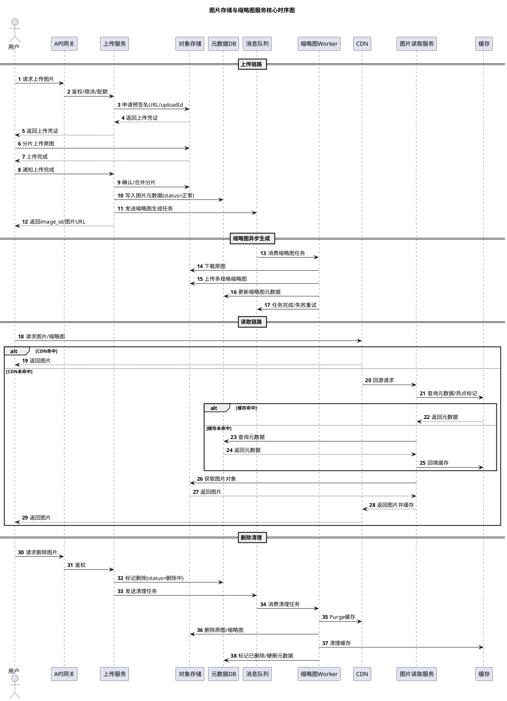

下面我以“资深架构师面试官”的视角来拆解题2：先给出我期望的参考设计方案，再给出我会继续追问的问题。核心矛盾是：**海量对象存储、元数据分片、缩略图异步生成、CDN 多级缓存、热点图片洪峰、分片上传、跨层垃圾清理、上传限流**。

  

---

  

## 一、面试官评估框架

  

我会重点看：


1. **上传/读取链路是否清晰**：上传直传对象存储，读取走 CDN。
2. **对象存储与 DB 职责是否分离**：图片存对象存储，元数据存 DB。
3. **缩略图策略是否有取舍**：预生成 vs 动态生成，是否混合。
4. **缓存分层是否合理**：CDN、本地缓存、Redis、对象存储。
5. **热点图片能否扛住**：CDN 边缘、预热、回源保护。
6. **分片上传与断点续传**：uploadId、分片、ETag、续传。
7. **垃圾清理是否跨层一致**：DB、对象存储、CDN、缓存。
8. **限流与安全**：防超大图、防刷、防恶意内容。
---

  

## 二、面试官参考设计方案

  

### 1. 需求与容量估算

  

- 上传：每日百万级，平均约 `1M / 86400 ≈ 12 QPS`，峰值按 10 倍约 `100+ QPS`。
- 读取：几十万 QPS，主要由 CDN 承担，回源可能只有 `1%~5%`。
- 存储：假设原图平均 5MB，日增约 `5TB`，年增约 `1.8PB`。
- 缩略图：假设 4 种规格，每张 50KB，日增约 `200GB`，年增约 `73TB`。
- 元数据：每日百万条，年约 `3.65亿` 条，必须分片。
- 图片 ID：全局唯一，可用发号器 + Base62，或 UUID，URL 不可枚举。
- 一致性：图片对象强一致或最终一致；缩略图异步生成，允许最终一致；删除跨层最终一致。
### 2. 整体架构与核心模块

  



  

核心模块：

  

- 接入层：API 网关、WAF、限流、鉴权。
- 上传服务：申请上传凭证、分片管理、回调校验。
- 对象存储：原图、缩略图、临时分片。
- 元数据服务：图片元数据、权限、状态、缩略图任务。
- 缩略图服务：异步 Worker，生成多规格缩略图。
- CDN：图片读取主入口，边缘缓存。
- 缓存层：本地缓存、Redis。
- 消息队列：异步任务、削峰。
- 清理服务：跨层删除。
- 风控审核：图片内容审核、黑名单、配额。

### 3. 存储选型与元数据

  

**对象存储职责：**
- 存原图、缩略图、分片临时文件。
- 选型：S3、OSS、COS、MinIO。
- 多副本、多 AZ、跨区域复制。
- 生命周期策略：临时分片过期删除、回收站延迟删除。

**DB 职责：**

- 存图片元数据、权限、状态、缩略图任务。
- 选型：MySQL 分库分表、TiDB、PostgreSQL 分片。
- 分片键：`image_id`，因为读图片天然按 image_id。
- 用户图片列表可按 `user_id` 建异构索引或 ES。


**元数据表示例：**
```sql
create table if not exist image(
	image_id bigint primary key,
	user_id bigint,
	object_key varchar(255),
	bucket varchar(64),
	size bigint,
	mime varchar(32),
	width int,
	height int,
	hash varchar(64),
	status tinyint, -- 上传中/正常/删除中/已删除
	created_at timestamp,
	deleted_at timestamp null
)

  

create table if not exist image_thumb(
	image_id bigint,
	spec varchar(32), -- 100x100, 400x400
	object_key varchar(255),
	status tinyint,
	primary key(image_id, spec)
)

```

  

### 4. 缩略图生成：预生成 vs 动态生成

  
| 方案 | 优点 | 缺点 |
|---|---|---|
| 上传时预生成 | 读取快、稳定、CDN 好缓存 | 存储成本高、规格固定 |
| 访问时动态生成 | 省存储、规格灵活 | 首次慢、计算压力大、回源洪峰 |
| 混合方案 | 常用规格预生成，长尾动态生成 | 实现复杂，但最实用 |

推荐：

- 上传后异步预生成常用规格：`100x100`、`400x400` 等。
- 冷门规格走动态生成，生成后写回对象存储和 CDN。
- 缩略图 URL 带规格和版本，如：`/img/{image_id}/400x400.jpg?v=1`。
- CDN 缓存缩略图，长 TTL，版本变化用新 URL。

### 5. 缓存策略：CDN、内存、对象存储分层


```text
浏览器缓存 -> CDN 边缘 -> 图片读取服务本地缓存 -> Redis -> 对象存储
```


- **浏览器**：`Cache-Control: public, max-age=31536000, immutable`。
- **CDN**：主缓存层，缓存原图和缩略图，回源保护。
- **本地缓存**：热点元数据、权限、热点图片标记。
- **Redis**：元数据、热点计数、任务状态、布隆过滤器。
- **对象存储**：持久层，不是缓存，但作为回源源站。

- 失效：删除/更新时 CDN purge + 新 object key + 版本号。


### 6. 热点图片应对流量洪峰

- CDN 边缘缓存，热点图片尽量不回源。
- 活动/爆款帖子提前预热到 CDN。
- 热点探测：实时统计 CDN 日志、Redis 计数，自动推边缘。
- 回源保护：合并回源、单飞、请求去重、限流。
- 多级缓存：本地缓存 + Redis + CDN。
- 降级：返回低质量缩略图、占位图、限流排队。
- 对象存储多副本、多区域读。

### 7. 大文件分片上传与断点续传


流程：
1. 客户端请求上传初始化。
2. 上传服务鉴权、限流、生成 `uploadId`。
3. 返回预签名 URL 或分片上传凭证。
4. 客户端分片上传到对象存储。
5. 上传完成后调 `CompleteMultipartUpload` 合并。
6. 对象存储回调或客户端通知上传服务。
7. 写元数据，发异步缩略图任务。

断点续传：

- 客户端记录 `uploadId`、已上传分片号、ETag。
- 重新上传时调 `ListParts` 获取已上传分片。
- 只补传未完成分片。
- 服务端保存上传会话，设置过期时间。
- 分片大小：如 5MB~100MB，根据文件大小动态调整。

  

### 8. 垃圾清理：用户删除图片如何清理各层

  

- 用户删除 -> DB 标记 `deleted`，返回成功。
- 异步清理任务：
- CDN purge。
- 删除对象存储原图和缩略图。
- 清理 Redis/本地缓存。
- 延迟硬删 DB 元数据，进回收站。
- 对象存储生命周期策略兜底：临时分片、回收站过期自动删。
- 防止误删：软删、回收站、审计、二次确认。
- 跨层最终一致，失败重试 + 死信队列。

  
### 9. 限流与安全

  

- 网关层：用户/IP/设备 上传 QPS、并发、带宽、文件大小、MIME 白名单。

- 用户配额：每日上传数、总存储量、单文件大小。

- 分片上传：限制分片大小、总分片数、上传会话数。

- 内容审核：异步图片审核、黑名单、举报。

- 防刷：短期预签名 URL、签名校验、回调校验、验证码。

- 大图打满带宽：限制单文件大小、总带宽、并发上传数、分片限速。

  

### 10. 降级容灾

  

- 对象存储多 AZ、跨区域复制。

- DB 分片、主从、只读副本。

- CDN 多厂商回源。

- 缩略图服务降级：返回原图、低质量图、占位图。

- 上传降级：排队、暂停非核心、只保小文件。

- 审核降级：先发后审，风险图片延迟展示。

  

---

  

## 三、面试官可能追问的问题

  

1. **图片 ID 怎么生成？** 发号器 + Base62，或 UUID；URL 不可枚举。

2. **为什么图片不存 DB？** 对象存储便宜、可扩展、适合大文件；DB 只存元数据。

3. **元数据怎么分片？** 按 `image_id` 哈希分片；用户列表用异构索引或 ES。

4. **缩略图预生成还是动态？** 常用预生成，长尾动态生成 + CDN 缓存。

5. **缩略图生成失败怎么办？** 重试 + 死信队列 + 状态标记 + 降级原图。

6. **CDN 缓存怎么失效？** purge + 版本化 URL + 新 object key。

7. **热点图片怎么发现？** CDN 日志、Redis 计数、实时流计算。

8. **热点图片回源打爆怎么办？** 合并回源、单飞、限流、预热、降级。

9. **分片上传断点续传怎么实现？** uploadId + ListParts + ETag + 本地记录。

10. **分片上传失败怎么清理？** 生命周期策略过期删除临时分片。

11. **删除图片后 CDN 还有缓存怎么办？** 异步 purge + 版本号 + 短期 TTL。

12. **对象存储删除失败怎么办？** 重试 + 死信 + 生命周期兜底。

13. **如何防止用户上传超大图？** 网关限制大小、分片限制、配额、带宽限流。

14. **如何防止恶意图片？** 内容审核、黑名单、举报、先审后发或先发后审。

15. **图片读取权限怎么控制？** 私有图片用签名 URL；公开图片走 CDN。

16. **CDN 回源鉴权怎么做？** 回源签名、Token、IP 白名单。

17. **多地域部署怎么做？** 对象存储跨区域复制，CDN 就近接入，DB 多活。

18. **如何压测几十万 QPS？** CDN 压测、回源压测、热点模拟、全链路压测。

19. **监控哪些指标？** 上传成功率、缩略图生成延迟、CDN 命中率、回源 QPS、P99。

20. **SLO 怎么定？** 图片读取 P99 < 100ms，CDN 命中率 > 95%，上传成功率 > 99.9%。

---

  

## 四、面试官眼中的加分项与红旗

  

**加分项：**
- 上传直传对象存储，服务端不中转大文件。
- 对象存储、DB、CDN 职责清晰。
- 缩略图混合生成，常用预生成、长尾动态。
- CDN 为主缓存，回源保护做得好。
- 分片上传、断点续传、垃圾清理跨层一致。
- 限流、配额、内容审核都有考虑。
- 能说清最终一致、异步任务、降级容灾。


**红旗：**
- 图片存 DB 或本地磁盘。
- 上传流量全走应用服务器。
- 缩略图全部动态生成，没有 CDN 缓存。
- 热点图片没有 CDN/预热/回源保护。
- 删除只删 DB，不清理对象存储和 CDN。
- 没有限流，用户可无限上传超大图。
- 忽略内容审核和私有图片权限。