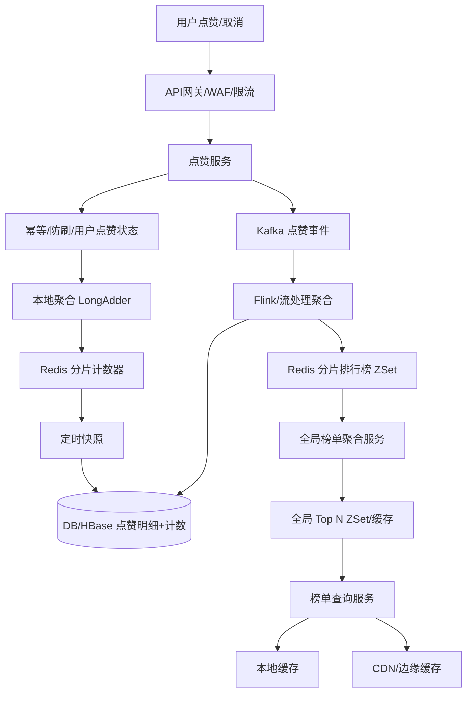

下面以“资深架构师面试官”的视角来拆解题3：**分布式计数器 / 全局排行榜**。核心矛盾是：**点赞写 QPS 极高、榜单读 QPS 极高、作品上亿导致单 Redis 放不下、热点作品写放大、Redis 宕机不能丢太多、业务允许几秒延迟的最终一致**。

---

## 一、面试官评估框架

我会重点看：

1. **是否敢不实时写 DB**：几十万 QPS 点赞，直接写 DB 必死。
2. **Redis 数据结构选型**：计数器用 String/Hash，排行榜用 Sorted Set。
3. **分片与全局聚合**：单 Redis 放不下时怎么分，分片后 Top N 怎么归并。
4. **热点处理**：爆款作品一秒上万赞，单 key 怎么抗。
5. **持久化与重建**：Redis 宕机后计数和榜单怎么恢复。
6. **一致性取舍**：为什么允许最终一致，误差业务能否接受。
7. **降级容灾**：Redis 挂了，点赞和榜单查询怎么保。

---

## 二、面试官参考设计方案

### 1. 需求与容量估算

- 点赞写：几十万 QPS，峰值可能百万 QPS。
- 榜单读：极高 QPS，必须走多级缓存，不能直接打 Redis/DB。
- 作品数：上亿，单 Redis ZSet 放不下，必须分片。
- 延迟要求：准实时，允许几秒延迟，最终一致。
- 点赞关系：亿用户 × 上亿作品，不能全放 Redis，需 DB 唯一索引兜底。
- 存储：点赞明细、作品计数、榜单快照需分片持久化。

### 2. 整体架构与核心模块



核心模块：

- 接入层：网关、限流、防刷、鉴权。
- 点赞服务：接收点赞/取消，幂等，本地聚合，写 Redis/Kafka。
- Redis 分片计数：作品点赞数，分桶抗热点。
- Kafka：点赞事件可靠缓冲。
- Flink/流处理：窗口聚合，更新排行榜和持久化。
- Redis 分片排行榜：Sorted Set，按作品分片。
- 全局榜单聚合：定时归并各分片 Top，生成全局 Top N。
- 榜单查询：多级缓存，CDN/本地缓存兜底。
- 持久化：DB/HBase 存明细和计数快照。
- 对账修复：定时比对 Redis 与 DB。

### 3. 点赞计数设计：不能每次写 DB

写路径：

```text
点赞请求 -> 网关限流 -> 点赞服务
  -> 校验用户/作品
  -> Redis 判断是否已点赞，防重复
  -> 本地聚合 + Redis INCR/DECR
  -> 发 Kafka 点赞事件
  -> 立即返回成功
```

关键点：

- **不实时写 DB**：几十万 QPS 直接写 DB，行锁、IO、连接池都会崩。
- **Redis 计数**：`INCR like:cnt:{workId}`，读时直接取。
- **本地聚合**：爆款作品在点赞服务内存中聚合，如每 100ms 或每 1000 次批量 `INCRBY`，减少 Redis 操作。
- **幂等**：用户点赞状态用 Redis Set/Bitmap + DB 唯一索引兜底。
- **取消点赞**：`DECR`，同样异步落库。
- **最终一致**：Redis 是加速层，DB 是持久层，允许短暂偏差。

### 4. Redis 方案

**计数器：**

- 普通作品：`String INCR like:cnt:{workId}`。
- 热点作品：分桶 `like:cnt:{workId}:{0..15}`，随机桶 `INCR`，读时 `MGET` 求和。
- 或 `Hash` 存多个计数维度。

**排行榜：**

- `ZINCRBY rank:like:global delta workId`。
- Top N：`ZREVRANGE rank:like:global 0 N-1 WITHSCORES`。
- 单 ZSet 上亿成员内存太大，必须分片。

**用户点赞状态：**

- `SADD like:user:{userId} workId`，`SISMEMBER` 判断。
- 大用户可用 Bitmap 或分片 Set。
- DB 唯一索引 `(user_id, work_id)` 最终兜底。

### 5. 分片与全局 Top 聚合

**分片方式：**

- 按 `workId hash` 分到 N 个分片，如 1024 个。
- 每个分片一个 ZSet：`rank:like:{bucket}`。
- 每个作品只属于一个分片，更新本地分片。
- 每个分片只维护 Top M，如 Top 1000，降低内存。

**全局 Top 聚合：**

```text
每 1~5 秒：
  聚合服务从所有分片 ZREVRANGE 0 M-1
  -> 归并排序
  -> 取全局 Top N
  -> 写入 global ZSet / 本地缓存 / CDN
```

优化：

- 分片多时用分层聚合：先组内聚合，再全局聚合。
- 或用 Flink 有状态聚合，直接输出全局 Top N。
- 查询 Top N 只读全局缓存，几秒更新一次，扛极高 QPS。

### 6. 热点作品处理

爆款作品一秒上万点赞：

- **本地聚合**：点赞服务内存 `LongAdder`，批量刷 Redis。
- **Redis 分桶**：`like:cnt:{workId}:{0..15}`，打散单 key。
- **Kafka 分区加盐**：避免同一作品全进一个分区。
- **榜单更新降频**：热点作品不必每次 `ZINCRBY`，批量更新。
- **CDN/本地缓存**：榜单查询走缓存，不回源。
- **限流与防刷**：用户维度、IP、设备限流，防脚本刷赞。
- **降级**：极端热点下，点赞只记 Kafka，榜单延迟更新。

### 7. 持久化：Redis 宕机怎么办

- Kafka 作为可靠事件日志：点赞事件先写 Kafka，持久化。
- Flink 消费 Kafka，批量写 DB/HBase。
- Redis 开 AOF + RDB，主从 + Cluster。
- 定期把 Redis 计数快照到 DB。
- Redis 宕机后：
  - 从 DB 恢复计数。
  - 或从 Kafka 重放最近事件重建。
- 对账任务：定时比对 Redis 与 DB，修复偏差。
- DB 表：
  - `work_like_count(work_id, count, updated_at)`
  - `user_like(user_id, work_id, created_at)` 唯一索引。

### 8. 一致性取舍

为什么不要求强一致：

- 点赞数允许几秒延迟，业务可接受。
- 强一致需要分布式事务，成本和延迟极高。
- 最终一致即可：点赞成功先返回，计数异步更新。
- 可接受误差：
  - 全局点赞数短暂偏差。
  - 榜单排名短暂抖动。
  - 取消点赞延迟生效。
  - 极端故障下少量事件重放导致重复，靠幂等修复。
- 但用户自己的点赞状态要尽量强一致：自己点赞后能看到。

### 9. 降级方案

- Redis 集群故障：
  - 点赞写本地聚合 + Kafka，返回成功。
  - 榜单查询返回上次快照/本地缓存。
  - 恢复后重放 Kafka，重建 Redis。
- Kafka 故障：
  - 本地磁盘缓冲，限流，优先保核心。
- DB 故障：
  - 不写 DB，Kafka 堆积，Redis 继续服务。
- 榜单查询：
  - CDN/本地缓存兜底，返回旧榜单。
- 多级降级开关：
  - 关闭实时计数，只记事件。
  - 关闭榜单更新，只读旧榜。
  - 限流非核心用户。

---

## 三、面试官可能追问的问题

1. 为什么点赞不能直接写 DB？
2. Redis 计数器用 String 还是 Hash？各有什么优缺点？
3. Sorted Set 底层结构是什么？为什么适合排行榜？
4. 单 Redis ZSet 上亿成员会有什么问题？
5. 分片键为什么选 workId？选 userId 会怎样？
6. 分片后全局 Top N 怎么聚合？多久聚合一次？
7. 热点作品一秒上万赞，单 key 怎么打散？
8. 本地聚合会不会丢数据？服务重启怎么办？
9. 用户重复点赞怎么防？Redis 和 DB 如何配合？
10. 取消点赞怎么处理？计数减错了怎么办？
11. Redis 宕机丢数据怎么办？Kafka 怎么重放？
12. 如何保证点赞事件不丢不重？幂等怎么做？
13. 榜单准实时几秒，Flink 窗口怎么设？
14. 榜单查询 QPS 极高，怎么扛？CDN 能缓存榜单吗？
15. 多机房部署怎么做？跨机房计数怎么聚合？
16. 分类榜单、地区榜单怎么设计？
17. 用户点赞列表怎么存？分页怎么查？
18. 防刷赞怎么做？机器刷赞如何识别？
19. 监控哪些指标？SLO 怎么定？
20. 压测怎么做？瓶颈会在哪？

---

## 四、面试官眼中的加分项与红旗

**加分项：**

- 明确不实时写 DB，Redis + Kafka + 异步落库。
- 本地聚合、分桶计数、分片 ZSet 处理热点。
- 分片后全局 Top 聚合方案清晰。
- 持久化、重放、对账、幂等都有考虑。
- 能说清最终一致和业务可接受误差。
- 降级方案能保核心链路。
- 防刷、限流、多级缓存都有设计。

**红旗：**

- 每次点赞直接写 DB。
- 单 Redis ZSet 存上亿作品。
- 没有热点处理，爆款作品打爆单 key。
- Redis 宕机就全丢，没有 Kafka/DB 兜底。
- 榜单查询直接打 Redis/DB。
- 忽略重复点赞、取消点赞、防刷。
- 追求强一致，导致架构过重不可用。